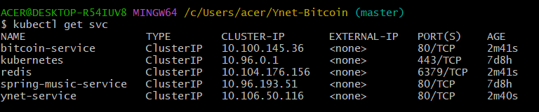
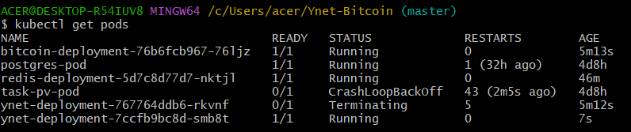
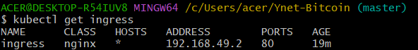
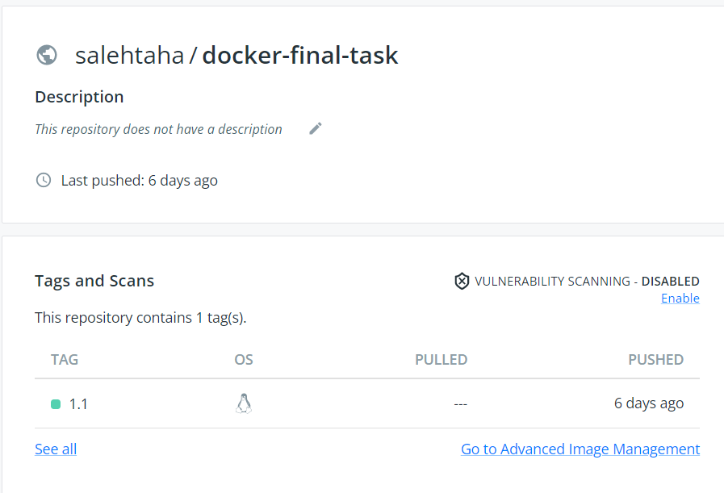
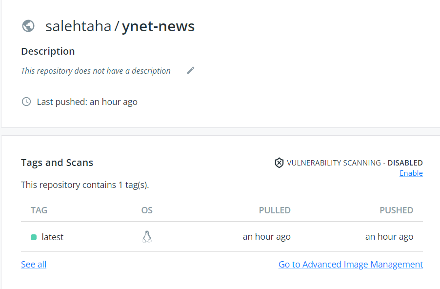

### Kubernetes-Ynet-Bitcoin

#### Kubernetes project that shows price of BitCoin and displays the latest news from Ynet:    
● Presents the Current BitCoin Price, And the Average Price for the last 10 minutes and stores the price in a Redis Database.  
● Reads the “Breaking News” from YNet news service.  
  

## Run With Minikube:

Clone the project

```bash
  git clone https://github.com/99tahasaleh/Kubernetes-Ynet-Bitcoin.git
```

Go to the project directory

```bash
  cd Kubernetes-Ynet-Bitcoin
```

Start minikube

```bash
  minikube start
```

Enable ingress addon

```bash
  minikube addons enable ingress
```
Apply Deployment

```bash
  kubectl apply -f .
```

Start minikube tunnel

```bash
  minikube tunnel
```

Access from browser:  

● http://localhost/bitcoin
● http://localhost/ynet  

## Services:


## Pods:


## Ingress:


## Run the apps with Docker

Run BitCoin image from DockerHub

```bash
  docker pull medris2796/bitcoin-final-task
  docker run -d -p 8000:5000 medris2796/bitcoin-final-task:latest
```


  
Run Ynet image from DockerHub

```bash
  docker pull medris2796/ynet
  docker run -d -p 8082:5000 medris2796/ynet:latest
```



